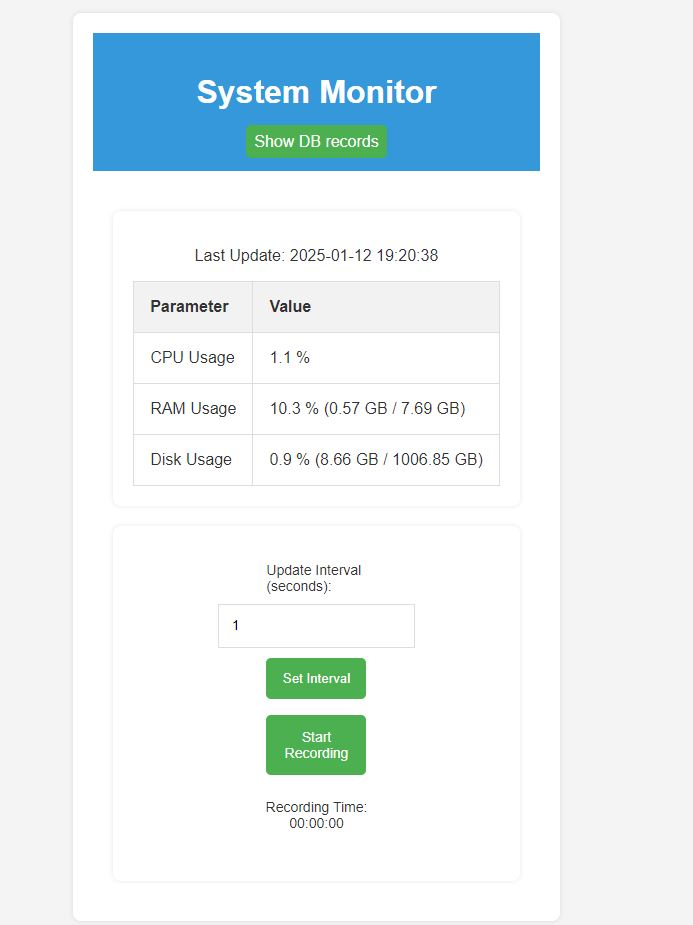
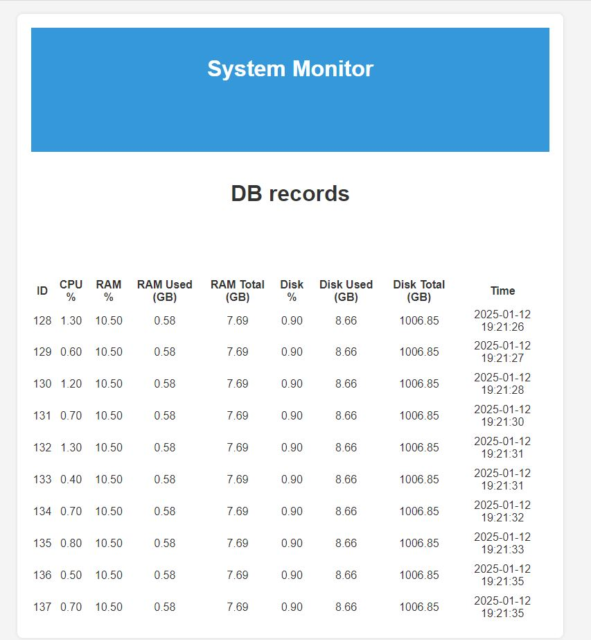
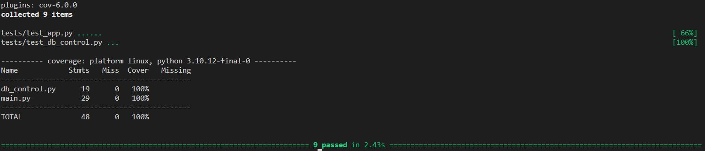

Simple web-app PC-monitor.
1. Install python, pip
2. Open root folder 'pc-monitor-main' (cd pc-monitor-main)
3. Create and start virtual environment:
  - python3 -m venv venv
  - source venv/bin/activate
4. Install requierements из requirements.txt:
  - pip install -r requirements.txt
    Start Flask server:
  - python3 app.py
    App will start on localhost.
  - Default update interval is 1 sec, data shows on the page
  - Button "Start Recording" creates DB Sqlite where data saved and timer starts. Is shows timestamps in DB.
  - Interaval can be set by "Set Interval" button.
  - Second tap on "Stop Recording" stopped recording to the DB, timer canceled to 0.
7. CI/CD on github actions (on push and pull requests).

 

